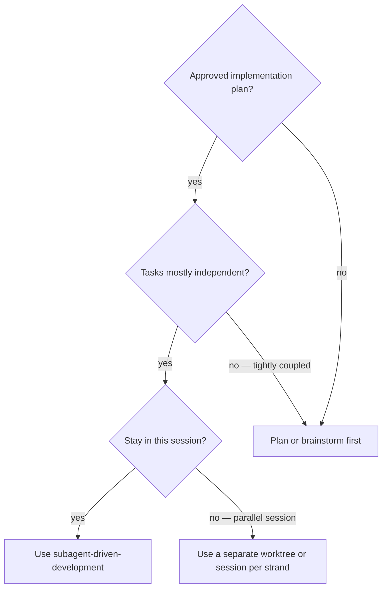

# Subagent-Driven Development

Execute planned work with the repository's configured reviewer roles. Select the **smallest** review
pipeline that covers the task's risk; agent count is not itself a quality metric.

**This skill is project-owned.** The reviewer roles in `.claude/agents/` are the source of review
policy, and harnesses without subagents read that directory as portable role prompts. Lifting this
skill into another repository is a manual pass that re-points those references.

**Core principle:** one writer at a time + independent, risk-matched review after a *stable*
implementation = high quality without duplicate context loading or repeated verification.

## Evidence and review selection (mandatory)

Before acting on any reviewer finding, **verify it against the source**. A finding whose test still
passes with the alleged bug is itself a finding about test coverage, not proof that the code is wrong.

**Fix the problem the reviewer found, not the remedy they proposed.** A finding's diagnosis is usually
right and its prescribed scope usually is not. Restate the failure in your own words, then choose the
narrowest change that removes it — a remedy applied wider than the problem trades one defect for
another, and the second one arrives with a passing test. Typical shape: a reviewer correctly finds
stale state outliving the condition that produced it and proposes clearing it on the next success;
clearing on *every* success then lets unrelated concurrent work erase that state before it is read.
What satisfies both is scoping the state to whatever produced it. A fix for a finding is still a fix —
it owes the same red-green proof as any other change.

When a confirmed finding may repeat across comparable artifacts, classify it as **cross-cutting** and
scan the full comparable population before closing it. Record the scan predicate and whether every
match was fixed, deferred with a target, or intentionally excluded with a reason; a comment anchor is
not the scope boundary.

Classify the task before selecting reviewers:

| Task risk | Required workflow |
| --- | --- |
| Narrow, local UI/client/docs change with no security, persistence, public-contract, or cross-module effect | One implementation pass; targeted checks; one independent configured reviewer matched to the surface. |
| A change confined to one module in the primary language | One implementation pass; targeted checks; `principal-engineer` review. Add `code-reviewer` when it also affects a public boundary or a non-language concern. |
| Security/auth, public API or contract, persistence/migration, tenancy, concurrency, cross-module architecture, or a broad refactor | One implementation pass; targeted checks; the relevant configured quality reviewers, `security-engineer` included. Use `code-reviewer` in spec-compliance mode when broad or ambiguous acceptance criteria make a separate pass useful. |

**No row permits zero reviewers.** If the surface has no matching specialist, fall back to
`code-reviewer` — never read a missing specialist as licence to skip the review.

Every implementation PR still needs independent review. A finding that changes behavior must have a
focused re-review and a test that fails without the fix. Do not re-run the complete pipeline for
documentation-only or mechanical follow-ups unless their scope changed.

Use the configured roles in `.claude/agents/`; **do not invent a reviewer role**. Give each selected
agent the exact task, the applicable invariants, the diff base, and the verification evidence.

## When to use

## The loop, per task

1. **Implement** one task from the plan. One writer, no parallel edits to the same surface.
2. **Focused checks** — the narrowest commands that prove *this* task. Not the full gate yet.
3. **Review** — one independent, risk-matched role, given the diff base and the invariants.
4. **Fix** — verified findings only, narrowest change, red-green proof, focused re-review if behaviour moved.
5. **Commit** — one isolated commit, message referencing `ADR-NNNN` where a sensitive path is touched.

Then the next task. The full clean gate runs once, in the last task, along with the record: ADR,
roadmap tick, `DEFERRED.md` rows, regenerated contracts.

## Anti-patterns

- **Reviewing an unstable implementation.** Findings land on code that is about to change; the pass is
  wasted and the second pass is treated as optional.
- **Adding reviewers to feel safer.** Three roles reporting the same finding is three contexts loaded
  for one defect. Match the role to the surface.
- **Acting on a finding without verifying it.** Reviewers report plausible defects that do not exist.
  Check the source; report back when the finding is wrong rather than "fixing" it.
- **Closing a cross-cutting finding at its anchor.** The comment marks where it was noticed, not where
  it stops.
