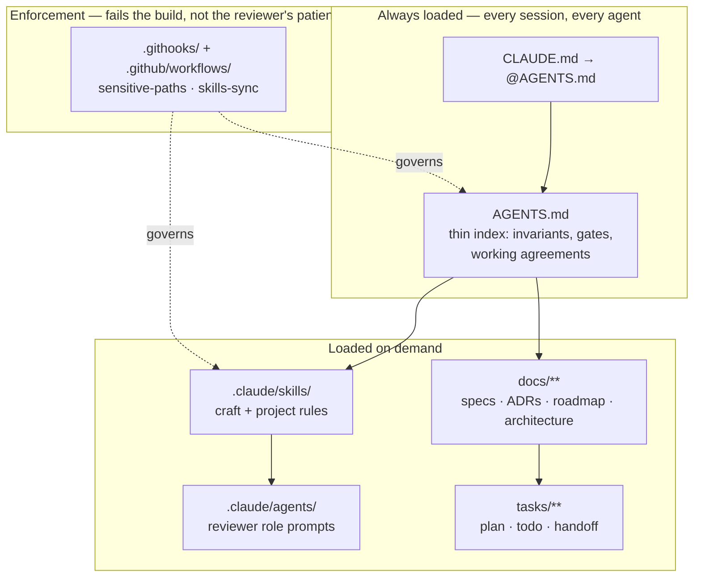

# sdd-harness

A **spec-driven development harness for coding agents** — the instruction layering, documentation
model, review orchestration, and enforcement gates that let an agent work on a real codebase over
months without re-deriving the project every session.

It is not a framework and it is not tied to a language or a stack. It is a **repository shape**: a
set of files an agent reads, a set of documents it writes, and a set of gates that fail the build
when either drifts.

> **Why it exists.** Agents forget. Sessions end, context windows compact, and the reasoning behind
> a decision leaves with them. Every piece of this harness exists to move something out of a session
> and into a file that outlives it — a decision into an ADR, a punt into a targeted row, a repeated
> correction into a rule, a half-finished feature into a handoff.

---

## The shape in one diagram



The rule that keeps it cheap: **`AGENTS.md` holds only what no gate can catch** — rules whose failure
is silent and corrupting. Everything a gate already enforces, plus all examples and rationale, lives
in a skill loaded on demand. A redundant always-loaded reminder costs tokens on every single turn.

---

## What is in here

| Path | What it is |
|------|-----------|
| [`AGENTS.md`](AGENTS.md) | The always-loaded instruction file, as a fill-in template. Canonical for **every** harness. |
| [`CLAUDE.md`](CLAUDE.md) | A one-line pointer to `AGENTS.md`. Never a second source of truth. |
| [`docs/HARNESS.md`](docs/HARNESS.md) | The harness structure, file by file, and why each layer exists. |
| [`docs/DOCUMENTATION-MODEL.md`](docs/DOCUMENTATION-MODEL.md) | Where each kind of documentation lives and the exact format of each. |
| [`docs/WORKFLOW.md`](docs/WORKFLOW.md) | The `/spec → /plan → /build → /test → /review → /ship` lifecycle and the review orchestration around it. |
| [`docs/TOOLS.md`](docs/TOOLS.md) | The tools this harness runs on: Agent Skills, code-review-graph, rtk, MCP servers, hooks. |
| [`docs/ADOPTING.md`](docs/ADOPTING.md) | Installing the harness into an existing repository, in order. |
| [`templates/`](templates/) | Copy-ready templates: spec, ADR, plan, todo, handoff, roadmap, deferred, lessons, project, session start. |
| [`.claude/skills/`](.claude/skills/) | Portable skills authored here, plus the two project-owned stubs every adopter fills in. |
| [`.claude/agents/`](.claude/agents/) | Reviewer role prompts, written to be readable by any harness — not just Claude Code. |
| [`.githooks/`](.githooks/) + [`.github/workflows/`](.github/workflows/) | The gates: sensitive-paths ADR policy and cross-harness skill sync. |

---

## Quick start

```bash
git clone https://github.com/<you>/sdd-harness
cd your-project

# 1. The instruction layer
cp ../sdd-harness/AGENTS.md ../sdd-harness/CLAUDE.md .
$EDITOR AGENTS.md              # fill in the invariants and gates for YOUR project

# 2. The documentation model
mkdir -p docs/architecture/adr docs/specs docs/session tasks
cp ../sdd-harness/templates/adr-0000-template.md docs/architecture/adr/0000-template.md
cp ../sdd-harness/templates/{ROADMAP,DEFERRED,LESSONS,PROJECT}.md docs/
cp ../sdd-harness/templates/SENSITIVE-PATHS.md docs/architecture/adr/

# 3. The gates
cp -R ../sdd-harness/.githooks .
cp ../sdd-harness/.github/workflows/config-policy.yml .github/workflows/
git config core.hooksPath .githooks

# 4. The agent layer
cp -R ../sdd-harness/.claude .
```

Then read [`docs/ADOPTING.md`](docs/ADOPTING.md) — it walks the same four steps with the decisions
each one asks of you.

---

## The five ideas this harness is made of

**1. One canonical instruction file, read by every agent.**
`AGENTS.md` is canonical; `CLAUDE.md` (and any other harness's file) is a pointer to it. Two
instruction files means two agents enforcing two versions of the same rule, with nothing reporting
the divergence.

**2. Documentation is layered by lifetime, not by topic.**
A decision that must outlive the code goes in an **ADR**. A feature's intent goes in a **spec**. The
sequencing goes in a **plan** and a **todo**. What a cold agent needs to resume goes in a **handoff**.
What was punted goes in **DEFERRED.md** *with a target*. What went procedurally wrong goes in
**LESSONS.md**. Nothing lives in two places, and everything cross-links by id.

**3. Rules earn their place by what a gate cannot catch.**
Formatting is a gate, so it is not a rule in the prompt. "Never read back what you just wrote" is not
mechanically checkable, so it is. This is the only thing keeping an always-loaded file from growing
into a context tax.

**4. Review is risk-matched and independent, never a rubber stamp.**
One writer at a time, then an independent reviewer selected by a risk matrix. Findings are verified
against source before they are acted on; a fix owes the same red-green proof as any other change.

**5. Verification is a run, not a claim.**
"Tests pass" means the command was executed and its output read. An incremental build is not a
verification. A green suite is not evidence that a new test bites — remove the behaviour, watch it
fail, restore it.

---

## Credits

The SDD lifecycle commands and the general engineering craft skills come from
**[Addy Osmani's Agent Skills](https://github.com/addyosmani/agent-skills)** (MIT), adopted as an
**installed dependency** rather than vendored. This harness is the layer *around* it: the repository
contract, the documentation model, the review orchestration, and the gates. See
[`docs/TOOLS.md`](docs/TOOLS.md) for installation.

## License

MIT — see [`LICENSE`](LICENSE).
