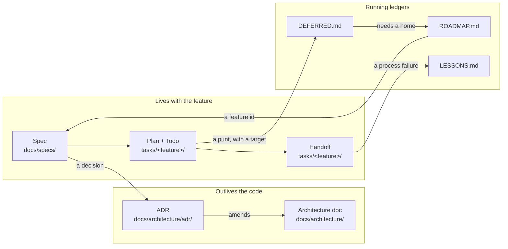

# The documentation model

Where each kind of documentation lives, what it is for, and the exact format it takes. Templates for
every document in this file are in [`../templates/`](../templates/).

The organizing idea: **documents are layered by lifetime.** A decision outlives the code that
implements it. A spec outlives the feature branch but not the product. A todo dies with the feature.
Putting a long-lived thing in a short-lived document is how projects lose their reasoning.



---

## 1. Specs — `docs/specs/YYYY-MM-DD-<feature>.md`

**What it is:** the intent of one feature, and the decisions it settles, written *before* the code
and approved by the developer. Date-prefixed so the directory reads chronologically; never renamed
when the roadmap renumbers (a spec is a point-in-time record).

**Header:**

```markdown
# F4-2 — <Feature title, stated as what it delivers>

- **Status:** draft, awaiting approval | approved | superseded
- **Date:** YYYY-MM-DD
- **Feature:** F4-2 ([`ROADMAP.md`](../ROADMAP.md))
- **Builds on:** F4-1 ([ADR-0033](../architecture/adr/0033-....md)), ADR-0021
- **Closes:** the `<row title>` row in [`DEFERRED.md`](../DEFERRED.md)
```

**Sections, in this order:**

1. **The gap** — what the product cannot do today, in the user's terms. One or two paragraphs. If you
   cannot state the gap without describing the implementation, the feature is not understood yet.
2. **Prior art** — how a reference implementation (an earlier product, a competitor, an OSS project)
   solves this, **and where it is wrong**. Name what is worth carrying and what inverts. This section
   is where most of the value is: a decision argued against a real precedent survives review.
3. **Decisions** — numbered, each one stating the choice, the alternative rejected, and *why*. A
   decision that changes a boundary or must outlive the code is promoted to an ADR and cited here.
4. **The surface** — the contract: endpoints, tool signatures, schema changes, problem types.
5. **Out of scope** — what this feature deliberately does not do, each item pointing at the roadmap
   row or `DEFERRED.md` target that owns it.
6. **Verification** — what proves it works, including how a new test is shown to *bite*.

**Rule:** a spec is approved by a human before a plan is written. No spec, no build.

## 2. ADRs — `docs/architecture/adr/NNNN-kebab-title.md`

**Format:** [MADR](https://adr.github.io/madr/). Numbered sequentially, never renumbered, never
deleted — an obsolete decision is marked `superseded by ADR-XXXX`.

**Write one when:**
- The change affects multiple modules or services (a contract, an event, a schema).
- It is a structural tooling change (CI policy, a hook, a new build module).
- The trade-off is non-obvious and the "why" must outlive the "what" (which is already in the code).
- It touches an architecture invariant in `AGENTS.md`.
- It touches a path listed in `SENSITIVE-PATHS.md` — this one is gated.

**Header, and it is load-bearing:**

```markdown
# ADR-0034 — <Decision, stated as the decision and not the topic>

- **Status:** proposed | accepted | superseded by ADR-XXXX
- **Date:** YYYY-MM-DD
- **Feature:** F4-2
- **Extends:** [ADR-0033](0033-....md)
- **Spec:** `docs/specs/YYYY-MM-DD-....md`
```

Then **Context** (the forces, including what a prior art gets wrong), **Decision** (numbered claims,
each with the rejected alternative), **Consequences** (easier / harder / neutral), **Alternatives
considered**.

**The index is part of the format.** `docs/architecture/adr/README.md` carries a table of every ADR
with its status, and each row **mirrors the `Status` field of the ADR itself** — keep both in sync
when promoting. An ADR amended by a later feature records the amendment inline in the index row
(`accepted (amended YYYY-MM-DD, F3-5 R2)`), so a reader knows the original text is not the whole story.

**Titles state the decision**, not the subject: "Service-identity token and tenant propagation over
MCP", not "Tenancy".

## 3. Sensitive paths — `docs/architecture/adr/SENSITIVE-PATHS.md`

A table of globs whose modification carries architectural or security weight, each with a one-line
reason. A commit touching one must reference an `ADR-NNNN`; a `commit-msg` hook and a CI job enforce
it. The list itself is a listed path — changing the policy is an architectural act.

**Put the reference in the commit message**, not only the PR body: the local hook only ever sees the
message.

## 4. Architecture docs — `docs/architecture/<subsystem>.md`

**What they are:** living descriptions of how a subsystem works *now* — the current shape, not the
history. An ADR says why a decision was taken; an architecture doc says what the system is.

Diagrams are **Mermaid**, never ASCII art. When a review pass falsifies a claim in one of these, amend
it **in the same PR** as the code — a stale architecture doc is worse than a missing one, because it
is believed.

## 5. Roadmap — `docs/ROADMAP.md`

Phases (0…N), each decomposing into numbered features (`F<phase>-<n>`), each phase with an explicit
**green criterion**: the observable condition that lets the next phase start.

- **This file is authoritative for feature numbering.** When a re-sequence renumbers phases, add a
  mapping table (`prior → now`) at the top rather than rewriting history: older specs and ADRs are
  point-in-time records and are *not* edited.
- Features are checkboxes; a shipped feature is ticked in the PR that ships it.
- An "Explicitly deferred" section carries product-level deferrals — the strategic ones. The
  implementation-level ones live in `DEFERRED.md`.

## 6. Deferred log — `docs/DEFERRED.md`

Grouped by **target** phase/feature, one table per group:

| Item | Deferred from | Notes / Target |
|------|---------------|----------------|

**The one hard rule:** every row states a **feature id or phase**, or is marked **Landed** or
**Dropped (decision)**. There is no "no fixed target yet" — an untargeted row is not tracked work, it
is a note nobody will action, and for a security item that is worse than not recording it at all.

Decide by blast radius: small and contained → do it now instead of writing the row; large or blocked
on a decision → schedule it by adding a feature to `ROADMAP.md`, so the deferral has a home.

When the target feature lands, **strike the row through** in that feature's PR and append the
resolution (`✅ Done in F4-2 (ADR-0034)…`), keeping the original note visible. A row is not closed by
deleting it — the reasoning is why it was written.

## 7. Lessons log — `docs/LESSONS.md`

A running record of **process failures worth not repeating**. Distinct from `DEFERRED.md`: that
tracks *what is left to build*, this tracks *how we work*.

**What earns an entry:** a failure whose cause was procedural — something a convention could have
prevented, or that an existing convention failed to prevent. *A bug found and fixed by a working gate
is not a lesson; that is the gate doing its job.*

**Entry format**, four fixed parts: **What happened** (concrete, with evidence), **Root cause** (the
procedural gap, not the symptom), **Change made** (which skill or convention — or explicitly none),
**Durable lesson** (the sentence worth carrying to another repository).

**Why the file exists at all:** skills carry the *shape* of a failure and never a PR number, branch,
or symbol from this codebase. That evidence has to live somewhere or the rule becomes an assertion
nobody can audit — so it lives here, and each entry names the skill it changed.

## 8. Plans and todos — `tasks/<feature>/plan.md`, `tasks/<feature>/todo.md`

**Plan** — written after the spec is approved. It carries:
- the branch and commit strategy (one isolated commit per task, so each slice stays reviewable);
- **Architecture decisions** — settled in the spec, repeated here as *the constraints a task may not
  quietly relax*;
- **Standing constraints** — the always-applicable rules this feature is most likely to trip over;
- one section per task: scope, the files it touches, its focused checks, its review.

**Todo** — the checklist, one line per task, ticked as each lands, with the spec and plan linked at
the top. Each task's definition of done is the same: *implement → focused checks → one independent
risk-matched review → fix → commit*.

## 9. Handoffs — `tasks/<feature>/handoff-<task>.md`

Written when a task will be picked up by an agent with **no context**. Its job is to make a cold start
land the scope the earlier tasks were built for, and nothing else.

Fixed sections:
- **Audience / branch / spec / plan** — and the precedence rule: *where this document and the spec
  disagree, the spec wins — report the discrepancy rather than picking one silently.*
- **Read before writing anything** — an ordered list, shortest sufficient set.
- **The one-paragraph version** — what this task changes, in prose.
- **State of the world (verify these, do not assume)** — what is already true, including what is
  currently *broken* on the branch and which task fixes it.
- **The work**, task by task, with the acceptance evidence for each.
- **Traps** — the specific mistakes this task invites.

## 10. Checkpoints — `docs/checkpoints/YYYY-MM-DD-<name>.md`

A periodic capability assessment against a reference implementation or a target: a scoreboard of what
exists versus what is missing, and a dated snapshot appended each time it is re-run. Re-run at the end
of each phase. It answers "how far is the shape closed?" — which a roadmap of ticked boxes does not.

## 11. Session start — `docs/session/START.md`

A reusable warm-start prompt: where the work stands, what landed and what did not, the failures this
feature keeps repeating, and a literal start prompt to paste. It is **ignored local continuity, not
durable policy** — update it as work moves, and put anything enduring in `AGENTS.md`, an ADR, or a
skill. It also carries the substitutions a non-Claude harness needs (lifecycle commands, reviewer
roles, missing MCP tools).

## 12. Generated contracts — `docs/api/`

OpenAPI documents, JSON schemas, and generated clients are **committed and regenerated in the same PR
as the change that alters them**. A contract regenerated later is a contract nobody reviewed.

---

## Cross-linking rules

- Reference by **id**, always: `F4-2`, `ADR-0034`, a spec path. Ids survive renames; titles do not.
- A spec links its ADRs; an ADR links its spec and the ADRs it extends or amends.
- A `DEFERRED.md` row links the ADR or spec that closed it.
- The ADR index status mirrors the ADR file's status.
- **Close the loop in the landing PR**: tick the `todo.md` line, tick the `ROADMAP.md` feature, strike
  the `DEFERRED.md` row, and amend any architecture doc the work falsified.
