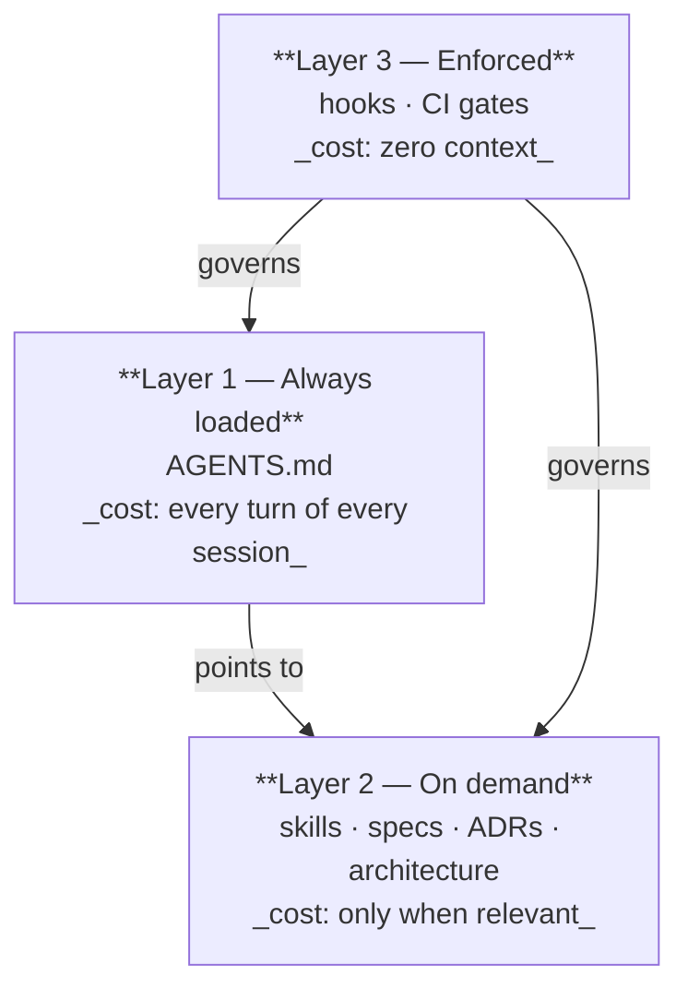

# The harness structure

Every file an agent reads, where it lives, and when it is loaded.

```
your-project/
├── AGENTS.md                     # ALWAYS LOADED — canonical instructions, thin index
├── CLAUDE.md                     # one line: @AGENTS.md
├── CONTRIBUTING.md               # MANDATORY (gated) vs SIGNAL (convention) — for humans and agents
├── .mcp.json                     # MCP servers (knowledge graph, docs, design)
│
├── .claude/
│   ├── settings.json             # permissions + hooks (context refresh, policy reminders)
│   ├── agents/                   # reviewer role prompts — portable, read by every harness
│   └── skills/                   # on-demand instruction modules
│       ├── README.md             # the skill index, grouped
│       └── <skill>/SKILL.md      # frontmatter + body; references/ loaded on demand
│
├── .githooks/                    # local policy gates (git config core.hooksPath .githooks)
├── .github/workflows/            # the same gates in CI, plus build/test
│
├── docs/
│   ├── PROJECT.md                # vision, stack, roles — the stable context
│   ├── ROADMAP.md                # phases and features, with green criteria — AUTHORITATIVE for ids
│   ├── DEFERRED.md               # implementation-level punts, every row with a target
│   ├── LESSONS.md                # process failures and the convention each one changed
│   ├── specs/                    # YYYY-MM-DD-<feature>.md — intent and decisions, per feature
│   ├── architecture/             # living design docs (one per subsystem)
│   │   └── adr/                  # numbered decision records + SENSITIVE-PATHS.md
│   ├── api/                      # generated contracts (OpenAPI, schemas) — committed
│   ├── checkpoints/              # periodic capability assessments against a reference
│   └── session/START.md          # warm-start prompt — ignored local continuity, not policy
│
└── tasks/
    └── <feature>/
        ├── plan.md               # task decomposition + the constraints a task may not relax
        ├── todo.md               # the checklist, ticked as tasks land
        └── handoff-<task>.md     # what a cold agent needs to pick up this exact task
```

---

## The three layers, and why the split is the whole point



**Layer 1 — `AGENTS.md`.** Loaded into every context window, so every line is paid for on every turn.
It holds *only* rules whose failure is **silent and corrupting** — the ones no gate can catch. A rule
that a formatter, a linter, or a CI job already enforces does not belong here; that is duplicated cost
for zero added safety.

**Layer 2 — skills and documents.** Everything with a trigger: a skill activates by its `description`,
a spec is read when the feature is worked on, an ADR is read when its decision is questioned. This is
where examples, rationale, and long checklists live. Moving a rule from Layer 1 to Layer 2 is how the
always-loaded file stays thin as the project grows.

**Layer 3 — gates.** A rule that *can* be mechanically checked should be, because a gate costs no
context and never forgets. Formatting, contract regeneration, cross-harness copy sync,
sensitive-path ADR references. When a Layer 1 rule becomes checkable, write the gate and delete the rule.

> **The decision procedure**, in one line: *can a gate catch it?* → Layer 3. *Does it need a trigger?*
> → Layer 2. *Neither, and silent failure?* → Layer 1.

---

## The instruction layer

**One canonical file.** `AGENTS.md` is read by every agent. `CLAUDE.md` contains `@AGENTS.md` and
nothing else. Any other harness's convention file is likewise a pointer. Two files of rules means two
agents enforcing two versions of them, with nothing reporting the divergence — that failure is silent
by construction, which is why it gets a gate (see below).

**Mirrors, if you need them.** Some harnesses read from their own directory (`.claude/skills/` vs
another tree). Where a rule must exist in two places for mechanical reasons, one tree is **canonical**
and the other is a **mirror**, and a CI job holds the project-authored files byte-identical. Vendored
third-party skills legitimately differ per harness and are excluded from the comparison — holding
those identical fails for the wrong reason.

## The skill layer

One skill = one directory = one `SKILL.md` with YAML frontmatter (`name`, `description`) and a body.
The `description` is the activation trigger, so it names the situations, symbols, and phrases that
should pull the skill in — not just the topic. Detail that is not always needed goes in
`references/`, loaded on demand.

Group skills in `.claude/skills/README.md` so a human, and a harness without auto-discovery, can find
them. Never re-add a skill the installed plugin already provides.

## The review layer

Reviewer roles are prompts, not code, and they live in `.claude/agents/`. Each carries two sections
this harness requires:

- **Repository Contract** — read `AGENTS.md` before the first tool call; it overrides generic
  instructions. Which navigation tools exist here. How the report should read.
- **Workflow Contract** — you are an independent reviewer, not an implementer; you were selected by
  the risk matrix; findings need source evidence and a concrete failure mode; a cross-cutting finding
  is scanned across its whole population before it is closed.

A heading alone is not the contract, which is why the sync gate checks for the governing clauses and
not just the headings.

## The task layer

`tasks/<feature>/` is working memory for one feature: `plan.md` (decomposition plus the constraints a
task may not quietly relax), `todo.md` (the checklist), and a `handoff-<task>.md` whenever a task will
be picked up by an agent with no context. The feature ships and the directory stays as a record of how
it was sequenced.

## What is deliberately *not* in the harness

- **A second place to put rules.** Anything that feels like "notes for the agent" belongs in
  `AGENTS.md`, a skill, or an ADR. Nowhere else.
- **Generated state in git that a tool rebuilds.** The knowledge graph index is local; the
  configuration that builds it is committed.
- **Session logs as policy.** `docs/session/START.md` is explicitly ignored-local continuity. Durable
  rules go to `AGENTS.md`, an ADR, or a skill — never to the warm-start file.
