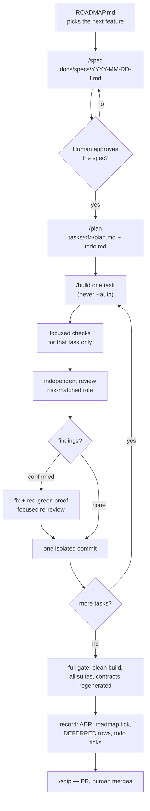

# The workflow

How work moves from an idea to a merged PR, and where the human sits in it.



---

## The lifecycle commands

`/spec → /plan → /build → /test → /review → /ship`, supplied by
[Agent Skills](https://github.com/addyosmani/agent-skills). A harness without them follows the same
sequence by hand; the discipline is the point, not the slash commands.

**Never `/build auto`.** A human reviews between tasks. The whole harness assumes a person is reading
each slice as it lands — that is what makes one isolated commit per task worth the bookkeeping.

## Branching and commits

```
<mainline>              ← protected
  └── feature/NNN-name  ·  fix/NNN-name
```

- One long-lived branch per feature; **one isolated commit per task**, so each slice stays
  independently reviewable.
- Never push without the developer's explicit confirmation. Never push to the mainline.
- A commit message referencing a sensitive path carries its `ADR-NNNN` — the local hook only reads
  the message, not the PR body.

## Review: risk-matched, independent, evidence-first

**Core principle:** one writer at a time, then an **independent** reviewer after a *stable*
implementation and its focused checks. Agent count is not a quality metric — select the smallest
pipeline that covers the risk.

| Task risk | Required workflow |
|---|---|
| Narrow, local change with no security, persistence, public-contract or cross-module effect | One implementation pass; targeted checks; **one** independent reviewer matched to the surface. |
| Change confined to one module in the primary language | One pass; targeted checks; the language specialist (`principal-engineer`). Add `code-reviewer` when it also touches a public boundary. |
| Security/auth, public API, persistence/migration, tenancy, concurrency, cross-module architecture, or a broad refactor | One pass; targeted checks; the relevant specialists, `security-engineer` included. |

**No row permits zero reviewers.** If no specialist matches the surface, fall back to `code-reviewer`
— a missing specialist is not licence to skip review.

**Rules the reviewer and the writer both owe:**

- **Verify every finding against the source before acting on it.** A finding whose test still passes
  with the alleged bug is a finding about test coverage, not proof the code is wrong.
- **Fix the problem the reviewer found, not the remedy they proposed.** A finding's diagnosis is
  usually right and its prescribed scope usually is not. Restate the failure in your own words, then
  choose the narrowest change that removes it — a remedy applied wider than the problem trades one
  defect for another, and the second arrives with a passing test.
- **A cross-cutting finding is scanned across its whole population** before it is closed. Record the
  scan predicate and whether every match was fixed, deferred with a target, or excluded with a reason.
  A comment anchor is not a scope boundary.
- **A fix for a finding owes the same red-green proof as any other change**, and a focused re-review
  when it changes behaviour. Do not re-run the whole pipeline for documentation or mechanical follow-ups.

## Verification: a run, not a claim

- **"The gate passes" means the command was executed and its output read.** Report failures with the
  output. Say plainly when a step was skipped. A false green costs more than a red build.
- **An incremental build is not a verification.** A non-clean run can execute stale test classes, so a
  new test can report green having never run. Only the clean command counts.
- **Prove a new test bites.** Remove the behaviour it names, watch it fail, restore it. A green suite
  is not evidence: tests pass for reasons other than the one they claim — a version assertion
  measuring an operation that writes twice, a "conflict" that was a mocking artifact, a stub ignoring
  the parameter the real server keys off.
- **Ship no contract surface without a consumer.** Before calling a slice done, find who reads each
  new field. If nobody does, wire it or drop it.

## The record a feature leaves behind

A feature is not done when the code works. In the landing PR:

- the `todo.md` lines are ticked and the `ROADMAP.md` feature is checked;
- every decision that must outlive the code is an **ADR**, and the ADR index status matches it;
- every punt is a **`DEFERRED.md`** row **with a target**;
- resolved rows are struck through with the resolution appended;
- any architecture doc the work falsified is **amended in the same PR**;
- generated contracts are regenerated in the same PR;
- the PR body states what was fixed, what was deferred and to where, and what was rejected with the reason.

## When a process failure happens

Write a `LESSONS.md` entry — what happened, the procedural root cause, the convention that changed,
and the durable one-sentence lesson. Then either strengthen the skill that should have prevented it,
or add the gate that makes it impossible. A lesson that changes nothing is a diary entry.
